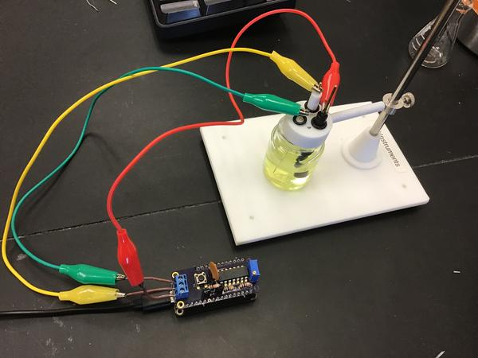
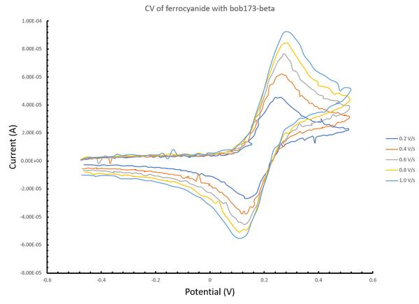
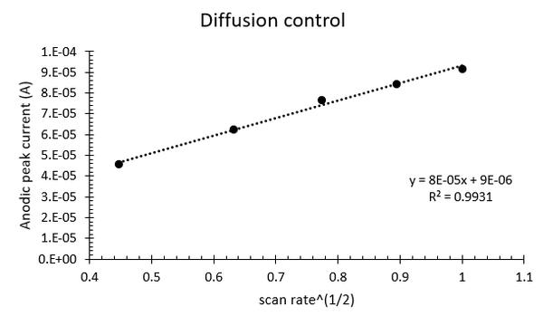
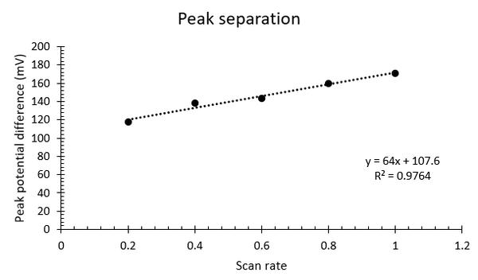

Current operation
=================

Experimental setup
~~~~~~~~~~~~~~~~~~

Here's an overview of the potentiostat Featherwing,  bob173-beta[*]_, connected to an electrochemical cell.

Details on the design are provided elsewhere and this page will focus on some example usage.  The setup is a 2 mm Pt disk working electrode with a Pt wire counter and Ag/AgCl reference.  The solution is ~ 10 mM potassium ferrocyanide in 0.1 M potassium nitrate.

Communication via python
~~~~~~~~~~~~~~~~~~~~~~~~

All FeAtHEr-Cm instrumentation will communicate with the user via the serial console interface.  The *easiest* way to do this is with a terminal  program such as `PuTTY <www.putty.org>`_ but the main limitation with that approach is the ease with which experimental data can be transferred.  Therefore, the next best approach is to interact with Python.  In addition to the standard Python installation (I'm using 3.9.6), the serial communication module needs to be installed with `pip install pyserial`.  Then, communication can be streamlined with the (to be documented) module `client.py`.  In a python shell, one would type:

.. code:: python

  >>> import client
  >>> f = client.fc('COM5')
  >>> f.send('get')
  >>> f.read()

The user sends commands using `f.send` and then reads the result using `f.read()`.  It's a primitive strategy at present.  The potentiostat understands how to get and set the scan rate, potential limits and sampling frequency.

.. code:: python

  >>> f.send('set SR 0.8')
  >>> f.send('set SP -0.4')
  >>> f.send('set SW 0.6')
  >>> f.send('set EN -0.4')
  >>> f.send('go')

The last command tells the potentiostat to perform the cyclic voltammogram.  The user needs to know how long the experiment will take because it is possible to read from the serial buffer before it is populated with the data.

.. code: python

  >> data = f.read(1)
  >> f.save('myfile.csv', data)

The `1` in the read command above tells the client software to strip text and format numbers for easy export (via `save`) to a CSV file. These CSV files can then be processed the same way you'd process any other data.

Example data
~~~~~~~~~~~~

Above is a collection of cyclic voltammograms obtained on the bob173-beta.  The solution contains ferrocyanide and the data are plotted such that positive potentials are to the right and anodic current is positive[*]_. The scan rates range from 0.2 to 1.0 V/s and show the expected increase in current with increasing scan rate.  There is a fair amount of noise in the voltammograms.  The current amplification resistor in this version of the potentiostat is 15 kOhm which is appropriate for currents in the upper 10s of microamps.  Thus, I would expect decreased noise with a better choice of amplification resistor.  Further, there is no attempt to shield the potentiostat from EMF, which will likely also contribute noise.

Example workup
~~~~~~~~~~~~~~

A limited amount of analysis can be done at this stage.  First, one can confirm that the electrochemical process is diffusion controlled by plotting peak current as a function of the square root of scan rate.  The plot is reasonably linear with nonlinearities likely due to the aforementioned noise and to a lesser extent some issues with uncompensated resistance.  An important next step is to repeat this experiment with precise concentrations in order to verify that the diffusion coefficient estimated from these data is consistent with literature values.

Chemical and electrochemical reversibility can be assessed by investigating the peak potentials and their currents.  Since the oxidation product, ferricyanide, is stable, it is expected that the ratio of the reverse to forward peak currents is close to one.  As calculated using the Nicholson equation, the ratio ranges from 0.91 to 0.95, which is a reasonable agreement given the rudimentary nature of the potentiostat.  Electrochemical reversibility is assessed by measuring the difference in peak potentials, as shown in the figure below.

At the slowest scan rates, the peak separation is approximately 120 mV, which is very large for this system and is likely influenced by uncompensated resistance.  The beta version of the potentiostat does not provide compensation.  While it is possible to incorporate the feature into a future design, it will be of limited use with the current platform since the microcontroller can only provide +/- 1.65 V and therefore will provide very little compliance.  That said, it is possible to improve the performance by using higher electrolyte concentrations and smaller electrodes.

Directions
~~~~~~~~~~

With this proof of concept data, we demonstrate that it is possible to perform electrochemical measurements with the bob173-beta featherwing.  The first area of improvement will be optimizing the current amplification stage and isolating the potentiostat from external interference.

client.py
~~~~~~~~~

Here's the module run on the client computer to interface with a FeAtHEr-Cm instrument.

.. code:: python

  import serial
  import csv
  from time import sleep

  class fc():
      def __init__(self, *argv):
          self.s = serial.Serial(argv[0],11500,timeout=1)

      def send(self, cmd):
          self.s.write(f'{cmd}\n\r'.encode('utf-8'))

      def read(self, *argv):
          r = []
          while self.s.in_waiting:
          	r = self.s.readlines()
          if len(argv) > 0:
              r = clean(r)
          return r

      def dia(self, cmd, duration = 1):
          self.send(cmd)
          sleep(duration)
          return self.read()

  def clean(response):
      out = []
      for i in response:
          try:
              out += [ list(map(float,i.strip(b'][\r\n').split(b', '))) ]
          # Silently ignore non-numbers
          except ValueError:
              pass
      return out

  def save(filename, data):
      with open(filename, mode='w') as f:
          fw = csv.writer(f, delimiter=',')
          for i in data:
              fw.writerow(i)

.. [*] The name is derived from the first potentiostat that I used as a graduate student at the University of Vermont: the PAR173 by Princeton Applied Research.  While you may think that I've named the Featherwing after myself, it is actually the acronym for Brockport Original Builds.
.. [*] Sorry Bill.
