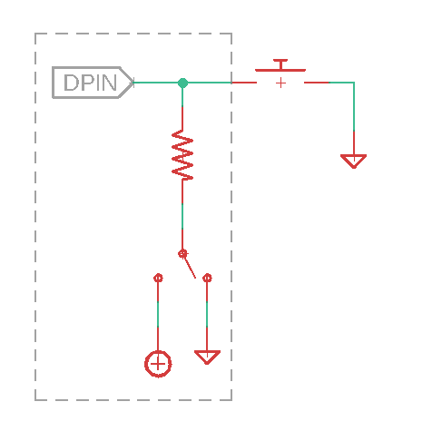

Back to Circuit Python
======================

The following examples make use of the bob173 featherwing, which you should be able to prepare now that you have worked through the soldering introduction.  If you have not yet built this featherwing, visit :ref:`howtobuild`.  After completing this suite of exercises, you should have a better understanding of digital and analog input.

.. note:: In the introduction to Python programming, you learned about the general structure of a microcontroller program (importing modules, initializing variables, defining functions and the loop routine), digital output (blinking the on-board LED) and accepting user input through the serial console.  You should also understand the difference between terms such as *function*, *variable*, and *argument*.  Revisit :ref:`programming_one` if these concepts are still challenging for you.

Digital input
~~~~~~~~~~~~~~

In the previous exercise, we learned that we can use digital output to turn an LED on or off.  In this exercise, you will learn how to read digital input.  The bob173 featherwing has a tactile switch (two actually) that is connected to one of the digital input/output pins of the microcontroller.  Looking at the schematic (LINK), you can answer the following questions:

.. admonition:: Questions

  * What digital pin is the button connected to?  (Hint, the name is also printed on the featherwing circuit board)
  * A tactile switch connects two points of the circuit.  In addition to the digital input/output noted above, what else is the switch connected to?

The basic program for initializing and blinking the built-in LED is reproduced here:

.. code:: python

  import board
  import digitalio
  import time

  led = digitalio.DigitalInOut(board.LED)
  led.direction = digitalio.Direction.OUTPUT

  while True:
    led.value = True
    time.sleep(0.1)
    led.value = False
    time.sleep(0.1)

Your task is to modify this code so that the LED is turned on/off with the push of a button.  The first task is to initialize the digital pin associated with the button.

.. code:: python

  btn = digitalio.DigitalInOut(board.D11)
  btn.direction = digitalio.Direction.INPUT

Note that we create a new *variable* for the button (`btn`) and assign it to the appropriate digital pin.  Next we set the direction of that pin to `INPUT` since the program will read the value of the pin.

How do we check if the button is pressed?  Notice from the schematic that the digital pin will be connected to ground when the button is pressed.  Therefore, we should be able to check for `btn.value == False`, which would indicate that the LED should be turned on (`led.value = True`).

.. code:: python

  while True:
    if btn.value == False:
      led.value = True
    else:
      led.value = False

If you try this code (and you should) you may find that the LED stays illuminated.  Something isn't quite right.  If we look back at the schematic, we get a hint about the issue.  We know what the value of the digital pin should be when the button is pressed, *but what is the value when the button is **not** pressed?*  That answer is not clear from the schematic.

.. admonition:: Question

  Based upon your observations on how the code runs, what do you think the *default* value of the digital pin is?

The issue we are facing is a common one, and is addressed internally by the microcontroller.  The simplified schematic below demonstrates what the microcontroller does to each of its digital pins:

  Generalized schematic of a pullup/down resistor

Internally, the digital pin is connected to a resistor.  That resistor can be fed either to ground or to the positive voltage supply.  If it is tied to ground, then the resistor is referred to as a *pulldown resistor* since an unconnected pin will be drawn to ground.  Conversely, a *pullup resistor* is tied to the positive supply, and will have a default high value.

To set the pullup/down value, we need to add one additional line to the setup of the button:

.. code:: python

  btn = digitalio.DigitalInOut(board.D11)
  btn.direction = digitalio.Direction.INPUT
  btn.pull = digitalio.Pull.UP

Now, when the button is *not* pressed, the default value fed to the digital pin will be True.  The code should now work as intended.

.. admonition:: On your own

  Modify the above code so that the LED is by default *on* and only turns off when the button is pressed.

Analog input
~~~~~~~~~~~~

With digital input/output, we can only deal with signals that are binary (on/off, high/low, true/false).  In order to access a continuum of values, analog input/output is required.  Many microcontrollers have pins that are capable of reading an analog value (analog inputs) but have to fake an analog output using a process called *pulse width modulation*.  The M4 microcontroller, however, has two pins that provide true analog output, which is one of the reasons it is an attractive component for instrument design.  In this exercise, we focus on analog input using the voltage divider labeled PVG on the bob173 featherwing.

.. admonition:: Question

  Return to the bob173 featherwing schematic and search for the name of the pin that is connected the voltage divider.  It is labeled `VGND`.  You are interested in the A# part of the name.

Enter the following code into your microcontroller

.. code:: python

  import board
  import analogio
  import time

  adc = analogio.AnalogIn(board.A4)

  while True:
      myval = adc.value
      print(myval)
      time.sleep(1)

At this point, you should see a number appear in the serial console that can be changed by turning the knob on the potentiometer.

.. note:: The term potentiometer is another name for a variable resistor.  The potentiometer used in this circuit requires 25 turns of the knob to go from 0 to 22 kOhm.

If you turn the knob clockwise or counterclockwise, you will find the minimum and maximum values are approximately 300 and 65000.  Nothing yet informs us what the *units* of these values are.  In principle, the value should range from 0 to 3.3 V since those are the minimum and maximum voltage values of the M4 microcontroller analog input pins.  In order to properly measure an analog signal, a microcontroller (or any computer, for that matter) must convert that signal into a digital format.  This process is called *analog to digital conversion*, where the microcontroller divides the range of possible analog values into a certain number of discrete value.  The number of discrete values is referred to as *resolution* and in this case, there are 65536 (:math:`2^{16}`) values.\ [*]_ In order to obtain an analog voltage from the analog pin reading, we must first perform a conversion.

.. math::

  V_{reading} = V_{max} \times \frac{\text{value}}{\text{max value}}

We can modify the python code above to report a voltage by adding the following line:

.. code:: python

  myvoltage = 3.3 * myval / 65536

.. note::

  If your program still returns an integer value, double check that you are printing the correct variable.

At this point, you should find that the output ranges from a value slightly above 0 V to slightly below 3.3 V.  To understand why the reading does not reach the minimum and maximum values, we first need to understand how real operational amplifiers work, so we'll circle back to this issue later in the course.

The last python tip in this activity is to format the results in a slightly nicer way.  We are going to replace the print statement with:

.. code:: python

  print(f'{myvoltage:.3f} V')

The above command uses what is called an *f-string* where f stands for *format*.  An f-string is a string in single quotes preceded by an f.  Curly braces inside an f-string are interpreted as variable placeholders, so instead of literally writing "{myvoltage:.3f}", the program will output the value of `myvoltage`.  The `:.3f` part allows for formatting the number of decimal places (in this case, 3).  Note that f-strings allow for the programmer to easily combine variables with text, so the incorporation of units as is done in this case, is straightforward.

.. admonition:: You try

  Change your program to output the voltage in millivolts with one decimal place.  This change will require you to modify both the value for `myvoltage` and the f-string.

.. [*] Technically, the M4 microcontroller has only 12 bit (:math:`2^{12}=4096`) resolution.  The authors of Circuit Python made the decision to convert all analog readings to 16-bit to make the output of the analogio functions platform independent.

.. tip:: See a problem?  Have a suggestion? Please `raise an issue <https://github.com/bobthechemist/feathercm/issues/new?title=cppart2.rst&labels=documentation>`_ and share your thoughts there.
