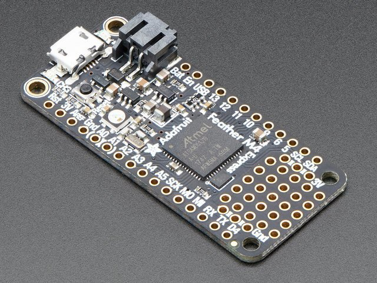

Programming microcontrollers
============================

The M4 Express
~~~~~~~~~~~~~~

The Adafruit Feather M4 Express is a microcontroller that provides sufficient resources and computing power to create pedagogically meaningful scientific instrumentation.  It can be programmed using either C++ or Python, and this text will use the latter - specifically CircuitPython - for all projects.

  The Adafruit Feather M4 Express (courtesy of Adafruit)

For more extensive details on how to use CircuitPython with M4 express, `visit Adafruit's web page <https://learn.adafruit.com/adafruit-feather-m4-express-atsamd51/circuitpython-pins-and-modules>`_.  Here you will find a summary of information that is necessary to get up and running.

The Bootloader
**************

All computer and computer-like devices require an operating system, and the software that loads this operating system into memory is called the *bootloader*.  For microcontrollers such as the M4 Express, the bootloader controls what type of programming language can be used for the device.  Due to the ease and accessibility, we use the UF2 bootloader, which allows the microcontroller to understand CircuitPython instructions and also makes updating the code extremely simple.

To install the latest bootloader, you must first `download the most recent stable version <https://circuitpython.org/board/feather_m4_express>`_.  Next, with the M4 Express connected to your computer with a USB cable, you will double-click the resent button.  At that point, a new drive (FEATHERBOOT) will appear on your computer.  Drag the `.uf2` file you downloaded previously to this drive, which will case the red LED on the board to flicker and the FEATHERBOOT drive will disappear.  A new drive, CIRCUITPY should appear, indicating that you have successfully updated the bootloader.

Programming with Mu
*******************

CircuitPython programs can be generated with any software that can generate text files; however, it is convenient to use a program designed for writing such code.  `Mu <https://codewith.mu/en/download>`_ is a simple program that provides everything needed for this course and is available for Windows, MacOS and Linux.  One of the advantages of Mu is that updating the software on the microcontroller is as simple as pressing the save button in the Mu software.  No additional task is needed.  Additionally, Mu (as well as other IDEs or Integrated Develop Environments) provides a tool for viewing output from the microcontroller using a *serial console*.

Circuit Python
~~~~~~~~~~~~~~

With the latest version of CircuitPython installed on the M4 Express and Mu up and running, it is time to start programming the microcontroller.  Type the following code into the Mu editor:

.. code:: python

  import board
  import digitalio
  import time

  led = digitalio.DigitalInOut(board.LED)
  led.direction = digitalio.Direction.OUTPUT

  while True:
      led.value = True
      time.sleep(0.5)
      led.value = False
      time.sleep(0.5)

Some things to note about python code:

* commands are *case sensitive* which means `True` and `true` are two different things.
* spacing is important.  Note that the code under the `while True:` line has been indented.  The size of the indent isn't important; however the fact that all subsequent lines are indented the same amount is important.

Once the above code is saved in a file named `code.py`, you will notice that a red LED begins to blink regularly on the M4.  Let's break down the code to see what was done.

.. code:: python

  import board
  import digitalio
  import time

These three lines import *modules* into memory.  Modules contain pre-written code that is intended to be reused.  In this case, `board` contains useful information like the location of the red LED.  `digitalio` contains information about controlling the digital inputs and outputs and `time` contains the sleep function, which allows a programmer to insert delays in the code.

.. note:: Look at the remaining code and identify where these modules are used.  You can tell they are used because the module names will precede a period.

.. code:: python

  led = digitalio.DigitalInOut(board.LED)
  led.direction = digitalio.Direction.OUTPUT

The first line highlighted here creates a *variable* called `led` that instructs the program communicate with the output connected to the red LED using digital signaling.  The second line indicates that digital signaling will be output from the microcontroller.

.. code:: python

  while True:
      led.value = True
      time.sleep(0.5)
      led.value = False
      time.sleep(0.5)

The remaining 5 lines contain the bulk of the program.  First a loop is established; the command `while True:` is one way to tell python to keep performing the subsequent tasks indefinitely.  The indentation identifies which commands should be performed during this loop.  The next line, `led.value = True` turns on the LED.  The subsequent lines tell python to do nothing for 0.5 seconds, turn off the LED, and wait another half second before repeating the loop.

Some things to try:

* Adjust the delays so that the LED is on for twice as long as it is off.
* Why are there two delays?  What happens if you remove one of the delays?
* What happens if you start by turning the led off before turning it on?

Before continuing, it is useful to get into the habit of including documentation in the code.  Comments can be included by prepending a line with a `#` symbol.  Any text following that symbol, up until the end of the line, will not be viewed as an instruction.  Excluding the `import` lines, add a comment before each line to describe what the code is doing.

Python Programming Activities
*****************************

.. note:: Below is an activity designed to introduce some python programming constructs.  In the future, additional activities will be incorporated into this section.

Morse Code Interpreter
^^^^^^^^^^^^^^^^^^^^^^

In this suite of four projects, you will learn how to blink an LED using the digitalio interface, add timing delays to your code, assign variables, define functions, accept user input, manipulate character strings, and use other programmer's code.

Introduction
------------

One of the challenges when programming with microcontrollers is the lack of a typical *interface*.  We have grown accustomed to computers and computer-like devices having a screen of some sort that can transmit information in a textual or graphical format.  A basic microcontroller does not have a display, and instead it must communicate with the user via the *serial console* - which requires access to another device that can read and display the serial console content - or other means such as light and sound.  In this activity, you will use the red LED embedded on the M4 Express microcontroller to communicate with the end user.

Because it is relatively straightforward to control the state (on/off) and timing of an LED, it is possible to develop a Morse Code like communication strategy.  Morse Code converts alphanumeric values into a series of dots and dashes.  These dots and dashes can be converted into LED blinks of varying durations.  Here are the timing rules for Morse code:

* The length of a dot is one time unit
* The length of a dash is 3 time units
* The delay between characters in the same letter is one time unit
* The delay between characters in the same word is three time units
* The delay between words is seven time units.

There is no official definition for the time unit, so that value can be whatever is *reasonable* for your application.

**Assignment submission** Should this activity be used as an assignment, the following submission guidelines are recommended.  Code for each of the four programs should be submitted with sufficient annotation of the code.  At a minimum, each function and flow control loop should be preceded with a comment indicating its operation, global variables should be described upon first use/assignment, and the program should begin with a comment section indicating the intended purpose of the program and the program's author.

In addition to annotated code, the submission should include a paragraph that comments on the following topics: describe the data domain conversions using Enke's data domain map; can the Morse code generator be considered a *signal transducer*; identify one modification to the code that could make the final program more concise without compromising readability.

Program 1
---------

Create a sequence of LED flashes that corresponds to the letter A.  Create a global variable that sets the unit of time to a value that is comprehensible to you.  The loop should include a word-length delay (7 time units)

**Optional Expansion** Repeat the same process but for a chemical symbol of your choosing.

Program 2
---------

Modify the first program to replace the on/delay/off sequences with functions. See `Chapter 3 <https://automatetheboringstuff.com/2e/chapter3/>`_ of *Automate the Boring Stuff* or perform a web search on *python functions* for help on the structure of functions in Python.  Functions should refer to a `global` variable that contains the standard unit of time (i.e. the duration of a dot).  Create functions for dot and dash that do not require arguments and a space function that takes an argument indicating a same letter, same word or between word delay.

Program 3
---------

Building on the functions from Program 2, allow the user to input a sequence of dots and dashes to the serial console and have that sequence displayed on the LED.  Your solution should involve an *if* statement, and details can be found in `Chapter 2 <https://automatetheboringstuff.com/2e/chapter2/>`_ of *Automate the Boring Stuff* or a web search on *python conditional statements*.  Your program should handle dots and dashes, treat spaces as letter delays and ignore all other characters.

Program 4
---------

Lastly, you are to incorporate another programmer's code into your own.  Refer to this `Morse code translator <https://www.geeksforgeeks.org/morse-code-translator-python/>`_ example and copy the definition for the variable `MORSE_CODE_DICT` and the function `encrypt` into your program.  Use the `encrypt` function to translate user input from alphanumeric text into Morse code.  Display the encrypted text in the serial console and blink the code on the LED.  This exercise introduces python dictionaries, which are covered in `Chapter 5 <https://automatetheboringstuff.com/2e/chapter5/>`_ of *Automate the Boring Stuff* or a web search on *python dictionaries*.

**Optional Expansion** Research the string method *upper()* and incorporate it into your program so that the user does not have to type her response in all capital letters.

Future
------

Can you create a game that emits the Morse code for a chemical element?
