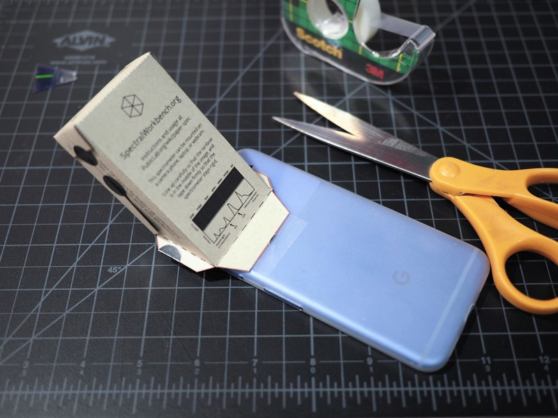

A Papercraft Spectroscope
=========================

We start this module by building a papercraft spectroscope that can be used with your phone.  The design was developed by `Public lab <https://publiclab.org>`_ and full details on the design can be found `on their website <https://publiclab.org/n/15276>`_.  Here, you will find the basic materials and suggested activities that relate to subsequent topics in the course.

Before building the instrument, it is worthwhile to discuss the basic components of a scientific instrument.  Most, if not all, scientific instrumentation can be broken down into five parts:[Rayson2004]_

* a source that generates the desired excitation or perturbation of the sample
* a sample compartment suitable to contain the sample in its appropriate form and quantity
* a discriminator that separates multiple signals emitted from the sample
* a detector that is capable of detecting the aforementioned signal at an appropriate level and within a suitable timeframe
* an output in a visual form appropriate for the characteristic that has been measured

Bill of Materials
~~~~~~~~~~~~~~~~~

You will need the following items:

* :download:`The papercraft box <bin/foldable-2.0.7.pdf>`
* scissors
* razor blade or craft knife
* tape, either clear or black.
* :download:`a piece of paper with a narrow slit <bin/slit-kit-1.pdf>` (more detailed instructions about the slit can be found `here <https://publiclab.org/n/15235>`_)
* a marker or some other way to darken the inside of the spectroscope box
* an old DVD (which will be destroyed)

Abbreviated procedure
~~~~~~~~~~~~~~~~~~~~~

Instructions and guidance are provided on the printed materials.  Cut out the spectroscope and fold as instructed. Secure the slit to the appropriate location in the box.  Carefully separate the two layers of the DVD by prying the edge of the disc with the razor blade.  Take care to avoid/minimize the amount of aluminum sheet that remains on the *bottom* plate of the disc.  The bottom side has grooves that can serve as a diffraction grating.  It is coated in a purple dye that can be removed, if desired, by gently rinsing in alcohol.  Cut the diffracting disc into the appropriate size and attach to the spectroscope.  Once complete, tape the spectroscope to a phone so that the camera can capture an image of the diffracted light.

  Completed spectroscope attached to a phone.

What to do now?
~~~~~~~~~~~~~~~

Your spectroscope can be used to differentiate various light sources.  In addition to typical sources such as fluorescent and incandescent light bulbs, consider the sun, streetlights, computer/phone screens, and LEDs.

Compare and contrast the spectra of various light sources.  Are there aspects of the different sources that are consistent?  How can you use the tools on your phone to record and compare various light sources?  Is it possible to identify one light source as *stronger* than another with this instrument?

Here, we refer to the instrument as a *spectroscope* whereas the original authors use the term *spectrometer*.  Research the difference between the terms and be prepared to argue which term is more suitable for the instrument you have fabricated.

Create a block diagram of the spectroscope.  Identify each of the five components, noting that some aspects of a scientific instrument may be missing or be represented by the same aspect of the instrument.
