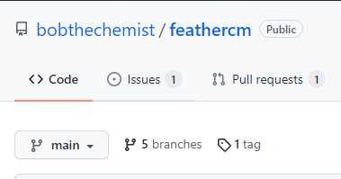

How to contribute to FeAtHEr-Cm
===============================

This project is designed to be open and accessible.  Furthermore, it is anticipated that consumers of the content will contribute suggestions and corrections so that the materials can continually be improved.  Here are the initial steps for participating in the FeAtHEr-Cm community.

* Create a Github account at `<https://github.com/>`_.
* Navigate to the repository for the course at `<https://github.com/bobthechemist/feathercm>`_.
* Use the `issues` tab to view open issues, raise concerns and propose suggestions.

  Go to the issues tab to view and raise issues.

* If you are familiar with how Github works, feel free to fork FeAtHEr-Cm so that you can create your own pull requests. (And if you have no idea what that sentence means, don't worry about it.)

**To do** Extracting relevant components of `<https://learn.adafruit.com/contribute-to-circuitpython-with-git-and-github/overview>`_
