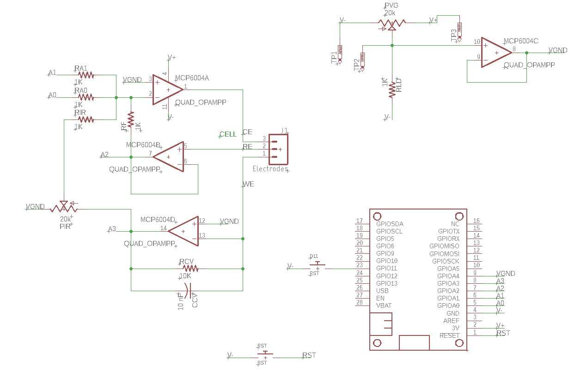

.. _howtobuild:

Building the potentiostat
=========================

Introduction
~~~~~~~~~~~~

The potentiostat board is referred to as the `bob173` and is currently in `beta` form.  The design is based upon a potential control amplifier in the adder configuration which is described in full detail in Bard and Faulkner's Electrochemical Methods. [Bard2001]_ The main component for the potentiostat is a quad opamp (MCP6004).  To complete the package, there is a 20 kOhm potentiometer for creating a voltage divider (needed for establishing a virtual ground), a three-terminal wire-to-board connector, a push button, two 1 KOhm resistors, a 10 nF capacitor and a 15 kOhm resistor.  The schematic for the board is below:

  Schematic for the bob173-gamma.  You can :download:`download the Eagle schematic and board files here <bin/bob173-gamma-design-files.zip>`

The Eagle documents above can be used to create a layout that is compatible with the Featherwing format.  Details for creating your own boards are forthcoming, but the project can be completed without using a featherwing (although it will not be as compact).  In addition to a breadboard and some wires, you will need items listed in the table below.

.. csv-table:: Bill of Materials
  :header: "Part", "Value", "Package"

  CCV,"10 nF","C-US075-032X103"
  D11,"RST","TACT_PANA-EVQ"
  J1,"Electrodes","SCREWTERMINAL-3.5MM-3"
  MCP6004,"QUAD_OPAMPP","DIL14"
  MS1,"FEATHERWING","FEATHERWING"
  PIR,"20k","TRIM_US-RJ9W"
  PVG,"20k","TRIM_US-RJ9W"
  RA0,"1K","R-US_0204/7"
  RA1,"1K","R-US_0204/7"
  RCV,"10K","R-US_0204/7"
  RF,"1K","R-US_0204/7"
  RIR,"1K","R-US_0204/7"
  RLD,"1K","R-US_0204/7"
  RST,"RST","TACT_PANA-EVQ"

Example project
~~~~~~~~~~~~~~~

The following tasks constitute a project to perform with the completed bob173 potentiostat.  An example of how to control the potentiostat and how to analyze the data is found in :ref:`example-data`.

1. Install the software onto the microcontroller.  Install Python on the computer and confirm that communication is established.
2. Calibrate the zero potential using a dummy cell (10 kOhm resistor).  Adjust the virtual ground (pin A4) until the application of zero V results in zero current.
3. Confirm that the current axis is correct by obtaining a cyclic voltammogram of the dummy cell with the default parameters.  The slope of the output should be equal to 1/R where R is the value of the resistor used.
4. Prepare a solution containing 0.1 M potassium nitrate along with approximately 5 mM potassium ferrocyanide.  Obtain an electrochemical cell consisting of platinum wire for the counter electrode, a platinum disk (1-3 mm diameter) for the working electrode and an aqueous silver/silver chloride reference electrode.  The working electrode should be polished with alumina slurry (or similar).  The cell does not need to be degassed for this experiment.
5. Perform cyclic voltammograms in the scan rate region of 0.1 to 1 V/s.  Optimize the starting/switching potentials as needed, and ensure that the best current-to-voltage resolution is obtained by swapping out the amplification resistor as needed.
6. Analyze the data to determine the diffusion coefficient of potassium ferrocyanide.  Also explore the chemical and electrochemical reversibility of the reaction.

.. warning:: The operation notes below relate to *Mathematica* and are just notes to self at this point.

Operation notes
~~~~~~~~~~~~~~~

Using a terminal program or python to communicate with the FeAtHEr-Cm instrument.  Mathematica can also be used via the ExternalEvaluate command.

.. code:: mathematica

  (* start python session, send/receive data *)
  s = StartExternalSession["Python"]
  ExternalEvaluate[s, "s.write(b'cmd\\n\\r')"]
  o = ExternalEvaluate[s, "
  r = []
  while s.in_waiting:
    r = s.readlines()
  r"]
  (* Convert data to useable form, removing linefeeds *)
  p = FromCharactercode@DeleteCases[Normal@o,13|10,2]
  (* Convert list of number strings *)
  p2 = ImportString["["<>StringRiffle[Rest@p,","]<>"]","PythonExpression"]

Perhaps this is an easier approach

.. code:: mathematica

  (* Start the session, call it s, and execute the initial commands *)
  s = StartExternalSession["Python"],
  ExternalEvaluate[s, "import serial, s = serial.Serial('COM3', 115200, \
  timeout=1)"]
  (* Create an external evaluate shortcut *)
  ee[x_String] := ExternalEvaluate[s, x]
  (* Check if data are in the buffer *)
  ee["s.in_waiting"]
  (* Send a command *)
  ee@"s.write(b'get\\n\\r')"
  (* Simplify command construction *)
  st = StringTemplate["s.write(b'``\\n\\r')"],
  ee@st["get"]
  (* View the response *)
  FromCharacterCode@DeleteCases[Normal@#, 13 | 10, 2] &@ee@"
  r = []
  while s.in_waiting:
  	r = s.readlines()
  r
  "
  (* Make that a function *)
  res := FromCharacterCode@DeleteCases[Normal@#, 13 | 10, 2] &@ee@"
  r = []
  while s.in_waiting:
  	r = s.readlines()
  r
  "
  (* perform a sweep *)
  ee@st["go"]
  Pause[5]
  out = res
  (* A clunky way to conver the result *)
  vals = ImportString["[" <> StringRiffle[Rest@out, ","] <> "]",
    "PythonExpression"]

.. tip:: See a problem?  Have a suggestion? Please `raise an issue <https://github.com/bobthechemist/feathercm/issues/new?title=bob173build.rst&labels=documentation>`_ and share your thoughts there.
