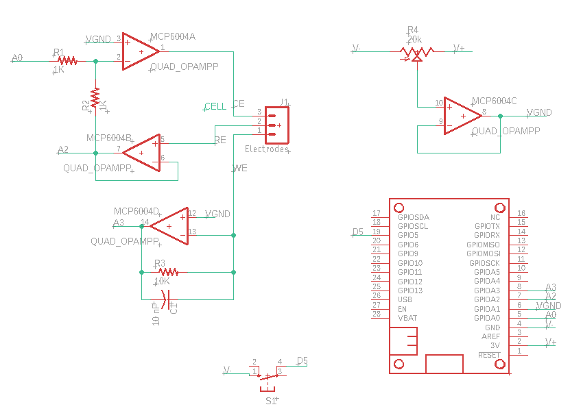

Building the potentiostat
=========================

Introduction
~~~~~~~~~~~~

The potentiostat board is referred to as the `bob173` and is currently in `beta` form.  The design is based upon a potential control amplifier in the adder configuration which is described in full detail in Bard and Faulkner's Electrochemical Methods. [BARD2001]_ The main component for the potentiostat is a quad opamp (MCP6004).  To complete the package, there is a 20 kOhm potentiometer for creating a voltage divider (needed for establishing a virtual ground), a three-terminal wire-to-board connector, a push button, two 1 KOhm resistors, a 10 nF capacitor and a 15 kOhm resistor.  The schematic for the board is below:

  Schematic for the bob173-beta.  You can :download:`download the Eagle schamtic and board files here <bin/bob173-beta-design-files.zip>`

The Eagle documents above can be used to create a layout that is compatible with the Featherwing format.  Details for creating your own boards are forthcoming, but the project can be completed without using a featherwing (although it will not be as compact).  In addition to a breadboard and some wires, you will need items listed in the table below.

.. csv-table:: Bill of Materials
  :header: "Part", "Value", "Package"

  "C1","10 nF","C-US050-025X075"
  "J1","Electrodes","SCREWTERMINAL-3.5MM-3"
  "MCP6004","QUAD_OPAMPP","DIL14"
  "MS1","FEATHERWING","FEATHERWING"
  "R1","1K","R-US_0204/7"
  "R2","1K","R-US_0204/7"
  "R3","10K","R-US_0204/7"
  "R4","20k","TRIM_US-RJ9W"
  "S1","N/A","B3F-10XX OMRON SWITCH"

.. [BARD2001] Bard, Allen J., and Larry R. Faulkner. Electrochemical methods : fundamentals and applications. Hoboken, NJ: John Wiley & Sons, Inc, 2001. Print.

Operation notes
~~~~~~~~~~~~~~~

Using a terminal program or python to communicate with the FeAtHEr-Cm instrument.  Mathematica can also be used via the ExternalEvaluate command.

.. code:: mathematica

  (* start python session, send/receive data *)
  s = StartExternalSession["Python"]
  ExternalEvaluate[s, "s.write(b'cmd\\n\\r')"]
  o = ExternalEvaluate[s, "
  r = []
  while s.in_waiting:
    r = s.readlines()
  r"]
  (* Convert data to useable form, removing linefeeds *)
  p = FromCharactercode@DeleteCases[Normal@o,13|10,2]
  (* Convert list of number strings *)
  p2 = ImportString["["<>StringRiffle[Rest@p,","]<>"]","PythonExpression"]

Perhaps this is an easier approach

.. code:: mathematica

  (* Start the session, call it s, and execute the initial commands *)
  s = StartExternalSession["Python"];
  ExternalEvaluate[s, "import serial; s = serial.Serial('COM3', 115200, \
  timeout=1)"]
  (* Create an external evaluate shortcut *)
  ee[x_String] := ExternalEvaluate[s, x]
  (* Check if data are in the buffer *)
  ee["s.in_waiting"]
  (* Send a command *)
  ee@"s.write(b'get\\n\\r')"
  (* Simplify command construction *)
  st = StringTemplate["s.write(b'``\\n\\r')"];
  ee@st["get"]
  (* View the response *)
  FromCharacterCode@DeleteCases[Normal@#, 13 | 10, 2] &@ee@"
  r = []
  while s.in_waiting:
  	r = s.readlines()
  r
  "
  (* Make that a function *)
  res := FromCharacterCode@DeleteCases[Normal@#, 13 | 10, 2] &@ee@"
  r = []
  while s.in_waiting:
  	r = s.readlines()
  r
  "
  (* perform a sweep *)
  ee@st["go"]
  Pause[5]
  out = res
  (* A clunky way to conver the result *)
  vals = ImportString["[" <> StringRiffle[Rest@out, ","] <> "]",
    "PythonExpression"]
