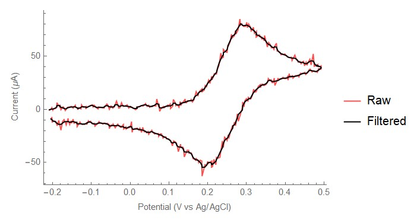
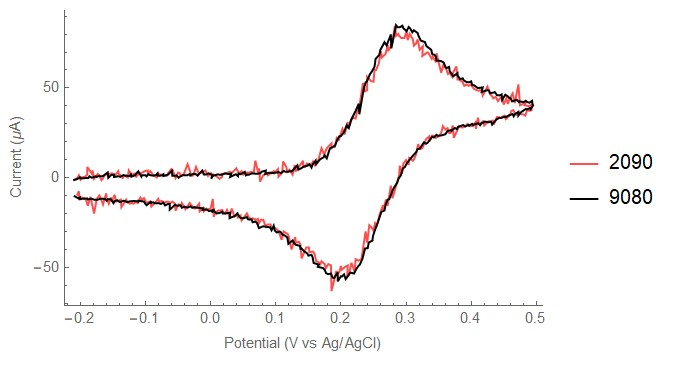
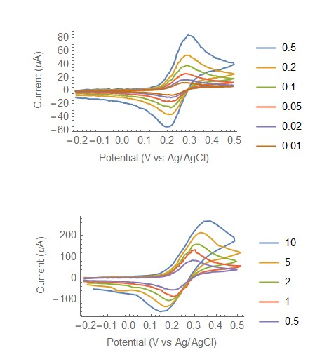
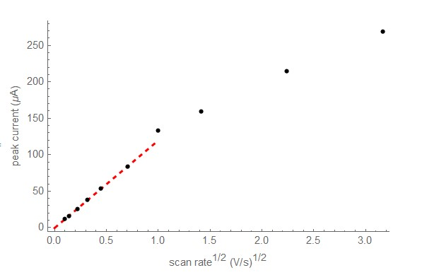
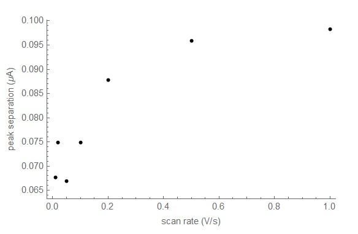

.. _exampleuse:

Current operation
=================

Experimental setup
~~~~~~~~~~~~~~~~~~

Here's an overview of the potentiostat Featherwing,  bob173-beta\ [*]_, connected to an electrochemical cell.

.. figure:: img/bob173-beta-use.jpg
  :align: center
  :alt: The bob173-beta featherwing potentiostat

Details on the design are provided elsewhere and this page will focus on some example usage.  The setup is a 2 mm Pt disk working electrode with a Pt wire counter and Ag/AgCl reference.  The solution is 4.81 mM potassium ferrocyanide in 0.10 M potassium chloride.  The beta version of the board is pictured; however the gamma version was used for data collection.

Communication via python
~~~~~~~~~~~~~~~~~~~~~~~~

All FeAtHEr-Cm instrumentation will communicate with the user via the serial console interface.  The *easiest* way to do this is with a terminal  program such as `PuTTY <www.putty.org>`_ but the main limitation with that approach is the ease with which experimental data can be transferred.  Therefore, the next best approach is to interact with Python.  In addition to the standard Python installation (I'm using 3.9.6), the serial communication module needs to be installed with `pip install pyserial`.  Then, communication can be streamlined with the (to be documented) module `client.py`.  In a python shell, one would type:

.. code:: python

  >>> import client
  >>> f = client.fc('COM5')
  >>> f.send('get')
  >>> f.read()

The user sends commands using `f.send` and then reads the result using `f.read()`.  It's a primitive strategy at present but the approach will allow for much flexibility, since many systems and programming languages are capable of communicating in this fashion.  The potentiostat understands how to get and set the scan rate, potential limits and sampling frequency.  It also needs to know the value of the resistor in the current to voltage converter.

.. code:: python

  >>> f.send('set SR 0.8')
  >>> f.send('set SP -0.4')
  >>> f.send('set SW 0.6')
  >>> f.send('set EN -0.4')
  >>> f.send('current 9080')
  >>> f.send('go')

The last command tells the potentiostat to perform the cyclic voltammogram.  The user needs to know how long the experiment will take because it is possible to read from the serial buffer before it is populated with the data.  On the gamma version of the board, a red LED is lit when a CV scan is in process.

.. code: python

  >> data = f.read(1)
  >> f.save('myfile.csv', data)

The `1` in the read command above tells the client software to strip text and format numbers for easy export (via `save`) to a CSV file. These CSV files can then be processed the same way you'd process any other data.

Example data
~~~~~~~~~~~~

  CV of ferrocyanide, 0.5 V/s, 2 mm Pt diameter electrode.  Anodic current is positive. Post processing (low-pass filter) performed in Mathematica.

Above is an example cyclic voltammogram obtained on the bob173-gamma.  The bob173 allows (rather, requires) the end user to manually select an appropriate resistor for the current to voltage conversion.  In this case, the resistor is nominally 2 kOhm, which results in fairly noisy data.  The peak current (~ 80 uA) corresponds to a voltage of 170 mV with this level of amplification, which is roughly 10% of the full scale (+/- 1.65 V) of the potentiostat.

  CVs at 0.5 V/s with two separate current-to-voltage resistor values.

As shown above, switching the resistor value in the current-to-voltage converter should have no impact on the overall shape and magnitude of the cyclic voltammogram so long as the resistance does not result in overloading the amplifier.  Switching to a nominally 10 kOhm resistor results in a maximum voltage output of 730 mV.  The noise in the CV with greater amplification is noticeably reduced.  Note that when setting the current value, the measured resistance was used instead of the stated resistance (e.g. 9080 Ohm instead of 10 kOhm).  The resistors used in this setup have a reported tolerance of 5%; therefore, it is important to use the actual resistance.  Nonetheless, it can be seen that the 10 kOhm resistor results in a slightly larger current than the 2 kOhm resistor, suggesting that one (or both) of the resistor values are slightly incorrect.  The percent difference between the two peak currents is 7%.

  Example of cyclic voltammograms from 10 mV/s to 10 V/s.  All voltammograms have been post processed with a low pass filter.

The figure above demonstrates the range of scan rates possible with the bob173-gamma.  After setting the current-to-voltage resistors properly (the lowest value used is 2 kOhm and the largest is 22 kOhm), scan rates between 10 mV/s and 10 V/s can be achieved.  At the highest scan rates, sampling frequency becomes a limiting factor.  The maximum sampling frequency is estimated to be 500 Hz and at 10 V/s with the potential range chosen here, the number of points in the CV is 48.  At the lower end of the scan-rate range, the issue is memory allocation.  Frequently, the low scan-rate scans fail with a memory allocation error.  This issue is likely a bug in the code and the current workaround is to lower the total number of points collected in a single CV scan.

.. note:: The bob173-gamma does have an option for iR compensation; however, it was not tested in this set of data.

Example workup
~~~~~~~~~~~~~~

Standard analysis of electrochemical data (workup) consists of exploring the change in peak current with scan rate, the increase in forward/reverse peak separations with scan rate, and the ratio of forward/reverse peak current as a function of scan rate.  Combined, these three analyses provide a general overview of the electrochemical system and allows for preliminary assignment of electron-transfer mechanisms and rates.

The average of the forward and reverse peak potentials is the :math:`E_{1/2}` relative to the reference electrode used.  This potential should stay constant throughout the range of scan rates employed for a redox system uncomplicated by additional chemical reactions.  The average potential for these data is :math:`0.250 \pm 0.004 V` vs Ag/AgCl which is in reasonable agreement with other reports.\ [*]_

  Peak current as a function of the square root of scan rate.  Red line is the best fit line through the data collected at scan rates below 1 V/s.

Above is a plot of the forward (anodic) peak current as a function of scan rate.  At scan rates below 1 V/s, the plot is linear, as expected from theory.  The deviation from linearity at higher scan rates could be due to ohmic drop, but it cannot yet be ruled out that instrumental factors such as sampling frequency and incorrect current-to-voltage settings are contributing factors.  Nonetheless, the lower scan rate data can be fit to the Randles-Sevcik equation in order to extract an estimate of the diffusion coefficient.

.. math::

    i_p = 2.69\times 10^5 n^\frac{3}{2} A C \sqrt{D \nu}

In the equation above, :math:`i_p` is the peak current, n is the number of electrons in the redox process, A is the electrode area in square cm, C is the concentration in mol/mL, D is the diffusion coefficient in cm/s and :math:`\nu` is the scan rate in V/s.  For the ferrocyanide data collected here, the best fit line through the low scan rate data has a slope of :math:`120\ \mu A s^{1/2} V^{-1/2}` which corresponds to a diffusion coefficient of :math:`8.7 \times 10^{-6}\ cm/s`. The reported value for the diffusion coefficient of ferrocyanide in potassium chloride is :math:`6.7 \times 10^{-6}\ cm/s`.\ [*]_ The error is reasonable given that the electrode diameter in this experiment is only known to the nearest mm.  The experimental error (30%) is much larger than what can be attributed to the estimated errors associated with the current-to-voltage conversion (7%) or the lack of temperature control (< 1 %).

The oxidation of potassium ferrocyanide is generally considered fast, and therefore the separation between the forward and reverse peaks should be approximately 59 mV and remain independent of scan rate.\ [*]_ In the figure below, :math:`\Delta E_p` is plotted as a function of scan rate up to 1 V/s.  At very low scan rates, the peak separation is independent of scan rate and approximately 72 mV.  As the scan rate increases, so does the :math:`\Delta E_p` in a non-linear fashion.  It is likely that ohmic losses are playing a role in the peak separation increase.

  Forward/reverse peak separation (:math:`\Delta E_p`) as a function of scan rate.

Lastly, the ratio of the reverse and forward peak currents provides insight into the chemical reversibility of the electron-transfer process.  Both ferro- and ferricyanide are chemically stable under the conditions used in this experiment, so it is expected that the peak current ratio would be close to 1 and independent of scan rate.  Using Nicholson's empirical method for assessing chemical reversibility requires the current at the switching potential.

.. math::

    \frac{i_{rev}}{i_{fwd}} = \frac{i_{rev}}{i_{fwd}} + 0.48 \times \frac{i_{switch}}{i_{fwd}} + 0.086

The peak ratio for the entire scan rate regime investigated here is :math:`0.972 \pm 0.02`, which is expected.  Note that due to the way data are acquired by the bob173, the sampling frequency may "miss" the switching potential.  upon close inspection of the raw data, the recorded data point closest to the switching potential was on average 3 mV less than the target value.

Discussion
~~~~~~~~~~

The results presented here demonstrate the ability to acquire electrochemical data on an ideal redox system with sufficient quality to perform standard analyses such as estimates of the diffusion coefficient and assessment of the chemical and electrochemical reversibility of the redox system.  Post processing of the data is required due to limitations in the analog to digital (ADC) circuitry of the microcontroller used (the M4 Express) as well as the absence of any hardware based noise reduction strategies.  While it would be possibile to eliminate these issues through additional hardware, it would defeat the pedagogical and price-point objectives of the project.  Presently, the bob173-gamma can be created for under $30.  The only additional components not considered in that price are a USB cable and a computer with a USB connection capable of running Python.  A Raspberry Pi computer can be purchased for under $100 (including power and SD card storage but *not* considering keyboard/mouse/monitor peripherals) which is capable of controlling the bob173 via Python as well as perform the post-processing/visualization using Mathematica.  Mathematica is not required for the rudimentary processing and visualization steps, which could also be completed in Python by expanding upon the client.py package.

Additionally, the bob-173 provides some key learning opportunities.  The three main points of understanding are: the design of a voltage divider and the need for buffering; adding signals together using an operational amplifier; and amplifying and converting current from a physical measurement into a voltage that can be read by a computer.  Completion of this module will include lesson plans that explore simulated (via the Falstad online circuit simulator) and hands-on (via the bob173) activities.

client.py
~~~~~~~~~

Here's the module run on the client computer to interface with a FeAtHEr-Cm instrument.

.. code:: python

  import serial
  import csv
  from time import sleep

  class fc():
      def __init__(self, *argv):
          self.s = serial.Serial(argv[0],11500,timeout=1)

      def send(self, cmd):
          self.s.write(f'{cmd}\n\r'.encode('utf-8'))

      def read(self, *argv):
          r = []
          while self.s.in_waiting:
          	r = self.s.readlines()
          if len(argv) > 0:
              r = clean(r)
          return r

      def dia(self, cmd, duration = 1):
          self.send(cmd)
          sleep(duration)
          return self.read()

  def clean(response):
      out = []
      for i in response:
          try:
              out += [ list(map(float,i.strip(b'][\r\n').split(b', '))) ]
          # Silently ignore non-numbers
          except ValueError:
              pass
      return out

  def save(filename, data):
      with open(filename, mode='w', newline='') as f:
          fw = csv.writer(f, delimiter=',')
          for i in data:
              fw.writerow(i)

.. rubric:: Footnotes

.. [*] The name is derived from the first potentiostat that I used as a graduate student at the University of Vermont: the PAR173 by Princeton Applied Research.  While you may think that I've named the Featherwing after myself, it is actually the acronym for Brockport Original Builds.

.. [*] Get this citation.

.. [*] See for example, `<https://www.asdlib.org/onlineArticles/elabware/kuwanaEC_lab/PDF-19-Experiment1.pdf>`_

.. [*] I do not have a good citation for the heterogeneous electron transfer rate of ferrocyanide.

.. warning:: See a problem?  Have a suggestion? Please `raise an issue <https://github.com/bobthechemist/feathercm/issues/new?title=exampleuse.rst&labels=documentation>`_ and share your thoughts there.
