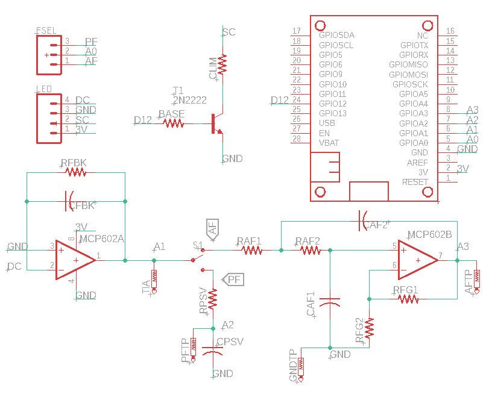

.. _turbidimetry_design_schematic:

Instrument schematic
~~~~~~~~~~~~~~~~~~~~

Schematic description
*********************

The btm-100 consists of a dual operational amplifier (MCP602) that serves the role of current to voltage converter (Op amp A) and an active 2-pole filter (Op amp B) and a transistor to control power to an LED source.  In addition, the board contains a passive filter which can be accessed via a tactile switch.  The passive components (capacitors and resistors) that set the signal amplification and filter cutoff frequencies are designed to be adjusted by the end user.

The default configuration has the following passive components

* RFBK: current to voltage converter feedback resistor, 10 MOhm
* CFBK: current to voltage converter feedback capacitor, 10 pF
* BASE: current limiting resistor to transistor base, 10 kOhm (should not be changed)
* CLIM: Current limiting resistor for source LED, 330 Ohm
* RAF1 and RAF2: Resistors in active filter, 33 kOhm (should be identical)
* CAF1 and CAF2: Capacitors in active filter, 1 uF (should be identical)
* RFG1 and RFG2: Gain resistors in active filter, 1 kOhm (Can leave RFG2 open and short RFG1 for an active filter with no amplification)
* RPSV: Resistor in passive filter, empty
* CPSV: Capacitor in passive filter, empty

Important relationships
***********************

In the section on exploring active and passive filters, we observed the relationship between output attenuation and input frequency.  The relationships can be described mathematically with the equations below.  It is not important to memorize these equations or know their derivations.

For the passive filter, the output is related to frequency through the following equation:

.. math::

  \frac{V_{out}}{V_{in}}=\frac{1}{\sqrt{1+(2 \pi f R C)^2}}

The active filter relationship is similar, but note that the denominator is not quite the same:

.. math::

  \frac{V_{out}}{V_{in}}=\frac{1}{1+(2 \pi f R C)^2}

Lastly, since the amplitude of an AC frequency is an energy (in volts), the definition of decibels is:

.. math::

  dB = 10 \log{\frac{V_{out}}{V_{in}}}

Exploring the schematic
***********************

1. Estimate the current flowing through the source.
2. How much current is applied to the base of the transistor in order to turn the digital switch on?
3. Calculate the cutoff frequency for the passive and active filters with the default component values.
4. The current to voltage converter behaves as a filter with the same performance as the passive filter.  What is the cutoff frequency (-3 dB) for the current to voltage converter with the default component values?
5. When an LED is exposed to light, current flows in the *opposite* direction (cathode to anode).  Notice which end of the LED is connected to the op amp and predict whether the op amp will perceive this current as positive (flowing towards the input) or negative (flowing away from the input).
6. Given the default components and the maximum voltage allowed for the M4 Express, predict the maximum current that can be detected from the LED without saturating the amplifier.
7. Recall that the M4 Express has 12-bit resolution (:math:`2^{12}`).  What is the smallest current that could be detected by the amplifier, assuming no noise.

.. tip:: See a problem?  Have a suggestion? Please `raise an issue <https://github.com/bobthechemist/feathercm/issues/new?title=design_schematic.rst&labels=documentation>`_ and share your thoughts there.
